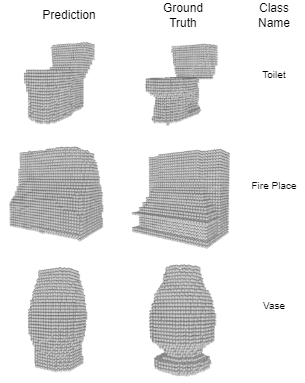

# Multi-View-3D-Reconstruction

This repository contains our final project for Machine Learning for 3D Geometry course at TUM. 
In this project we tried to improve the original work[Multi-view Convolutional Neural Networks for 3D Shape Recognition](http://vis-www.cs.umass.edu/mvcnn/docs/su15mvcnn.pdf) by:

- Replacing backbone model from VGG to recent CNNs
- Introducing attention module
- Implementing a novel regularization method called ViewDropout which cuts information flow from some of the views in the training stage

## Results

The obtained results are given in the below table. We observed that adding attention mechanism did not improve the results but ViewDropout increased each models' metrics. 
| Model Name      | Baseline | Attention | Dropout |
|-----------------|----------|-----------|---------|
| MVCNN-(Alexnet) | 90.64    | 90.44     | 91.17   |
| MVCNN-Resnet    | 93.88    | 89.71     | 94.17   |

A sample output of our model:

The code for the original paper is based on [RBirkeland's code](https://github.com/RBirkeland/MVCNN-PyTorch) and
our implementation for model with the attention is very similar to the work [Robust Attentional Aggregation of Deep Feature Sets for Multi-view 3D Reconstruction](https://arxiv.org/abs/1808.00758).  

